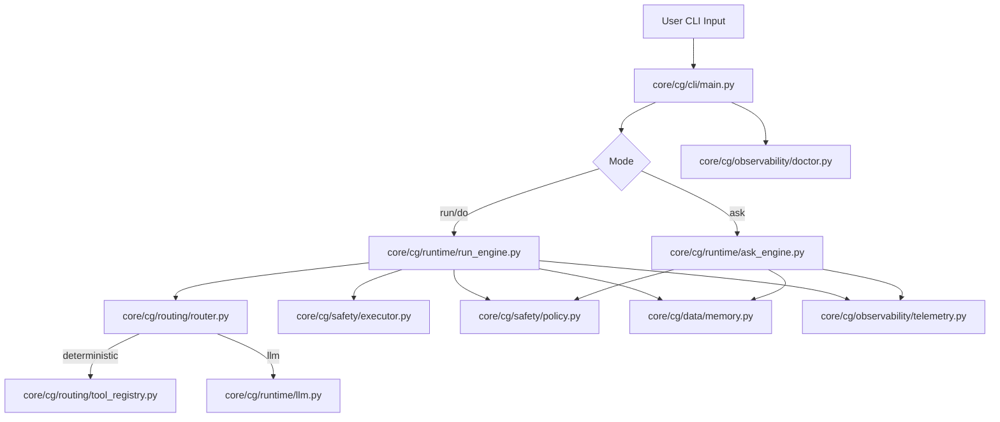
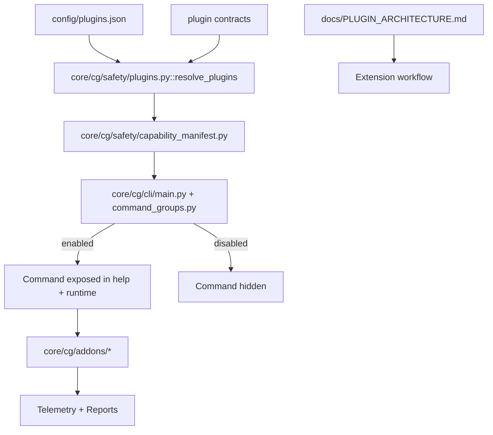

# Architecture (Core + Plugin Lifecycle)

## Core Runtime Architecture

## Plugin Lifecycle Architecture

## Separation of Concerns

- `cli/`: command surfaces and user interaction flow
- `runtime/`: ask/run engines and model orchestration
- `routing/`: deterministic scoring and route decisions
- `safety/`: policy, executor, plugin contracts, capability manifest
- `data/`: memory, paths, env loading
- `observability/`: telemetry and diagnostics
- `addons/`: optional plugin implementations
